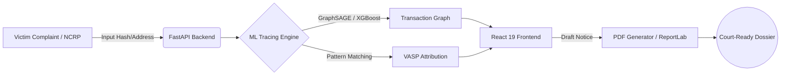

# 🛡️ BLUCE LOCK | High-Density Law Enforcement Workstation

<div align="center">
  <h3>Real-Time Crypto Fraud Attribution & VASP Intelligence Platform</h3>
  <p><em>An enterprise-grade, Sec. 65B CrPC compliant blockchain forensics suite designed to accelerate cybercrime investigations, trace stolen assets, and automate statutory freeze notices.</em></p>
</div>

---

## 🛑 The Challenge vs. ⚡ The Solution

**The Challenge:**
Crypto-laundering operations exploit the speed of blockchains. When victims report fraud, threat actors utilize automated mule networks, peel-chains, and cross-chain bridges to obfuscate the fund flow. Manual tracing by law enforcement often results in dead ends, as funds are cashed out via centralized exchanges (VASPs) before freeze requests can be drafted.

**The Solution:**
**BLUCE LOCK** operates as a high-density, real-time forensic workstation. It ingests suspect wallet addresses, automatically executes Multi-Hop Breadth-First Search (BFS) tracing, filters out noise (change wallets/burners), and accurately attributes the final destination to a registered VASP. It then generates court-ready statutory freeze notices (Sec. 91 / 102 CrPC) in one click.

---

## 🎯 Core Capabilities

- **Interactive Visual Fund Flow:** A Dagre-powered force-directed graph rendering real-time fund hops, identifying Victim, Mule Relay, Bridge, and Exchange nodes with precise semantic color coding.
- **VASP Intelligence Engine:** Instantly flags the destination exchange with a probabilistic confidence score (e.g., *Binance: 91% Confidence*), extracting subpoena emails and target deposit addresses.
- **Cross-Chain Bridge Tracking:** Seamlessly follows illicit asset movements across disparate networks (e.g., Ethereum → Polygon via Stargate).
- **ML-Powered Risk Profiling:** Analyzes transaction velocity, contract bytecode presence, and clustering patterns to generate an automated 0-100 Threat Score.
- **Automated Legal Dossiers:** Eliminates administrative overhead by auto-generating Sec. 91 CrPC notices and immutable Chain of Custody audit logs.

---

## 🏗️ System Architecture

BLUCE LOCK utilizes a modern, decoupled microservices architecture optimized for rapid data ingestion and high-fidelity rendering.



### 💻 Technology Stack

| Layer | Technologies Used | Purpose |
| :--- | :--- | :--- |
| **Frontend UI** | React 19, TypeScript, Vite, Tailwind CSS | High-density, Enterprise Light Mode forensic console |
| **Graph Renderer** | `@xyflow/react` (React Flow), Dagre | Auto-layout force-directed transaction mapping |
| **Backend API** | FastAPI, Uvicorn, Python 3.11+ | Asynchronous REST endpoints and data orchestration |
| **ML & Graph Engine** | NetworkX, PyTorch Geometric, XGBoost | Anomaly detection, node clustering, and pathfinding |
| **Document Ops** | ReportLab | Immutable, legally compliant PDF generation |

---

## 🚀 Quick Start & Deployment

### 1. Initialize the Backend Services
The Python tracing engine handles graph generation and ML inference.

```bash
cd backend
python -m venv venv
# Activate virtual environment:
# Windows: .\venv\Scripts\activate | Linux/macOS: source venv/bin/activate

pip install -r requirements.txt
python -m uvicorn app.main:app --reload --port 8000
```
> *API Documentation automatically generated at:* `http://localhost:8000/docs`

### 2. Launch the Forensic Console
The React 19 frontend provides the visual workstation for analysts.

```bash
cd frontend
npm install
npm run dev
```
> *Forensic Console live at:* `http://localhost:5173`

---

## 🛡️ Operational Walkthrough

1. **Initialize Investigation:** Access the dashboard and load an active case file (e.g., `NCRP-2026-00182`).
2. **Analyze the Flow:** Utilize the floating control dock (MiniMap, Zoom, Layout Toggles) to inspect the animated flow of funds from the victim's wallet through intermediary mules.
3. **Inspect the VASP Hit:** Open the right-side **VASP INTELLIGENCE** tab to review the attributed exchange and the evidentiary checklist.
4. **Draft Freeze Notice:** Click **Draft Sec. 91 Notice** to trigger the automated modal, verify the auto-filled deposit address and subpoena target, and generate the final PDF dossier.

---

*BLUCE LOCK — Precision tools for modern cybercrime enforcement.*